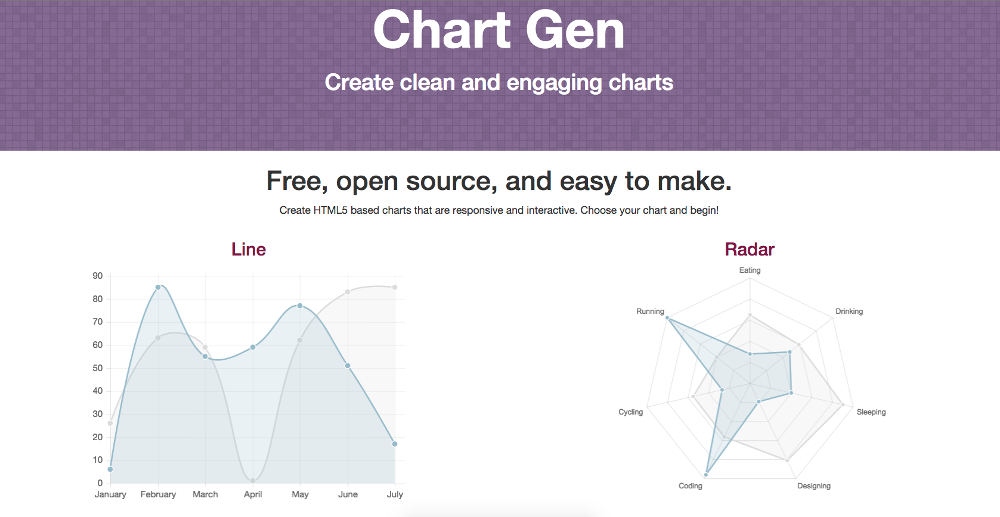

# Chart Gen
### by [Meyyappan Nachiappan](http://mnachiappan.com)

## Description
**Chart Gen** is a web application used to create charts that can be embedded in websites. These charts are responsive to all screen sizes and are interactive. 

The types of charts that can be made for now are line, bar and radar.

## How to Use
1. Navigate to [Chart Gen](http://chartgen.org).
2. Select chart and start entering data.
3. The application will generate the files needed to embed your chart.

## Built With
* AngularJS
* Bootstrap
